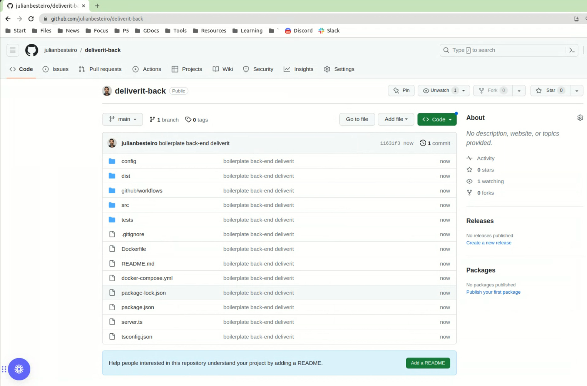

# GitFlow Workflow for DeliverIT

Our team will be using the GitFlow workflow for managing the development and maintenance of our application, DeliverIT as a solution to the problem of maintaining a software project in which several developers or teams are collaborating.

## Branching Strategy

Our repository will have two main branches with an infinite lifetime:

1. **Main**: This branch will contain the official release history, and each commit on this branch will represent a new production release. All the code in the master branch is deployable and is essentially production-ready.

2. **Develop**: This branch serves as an integration branch for features. It contains the complete history of the project, whereas main contains an abridged version. All the code in the develop branch is in a beta state, testable and runnable, but not necessarily production-ready.

In addition to these main branches, we will maintain various support branches:

- **Feature branches**: These branches are used to develop new features for the upcoming or a distant future release. When starting development of a feature, the target release in which this feature will be incorporated may well be unknown at that point. The essence of a feature branch is that it exists as long as the feature is in development, but will eventually be merged back into develop or discarded.

- **Bugfix branches**: These branches are used to prepare code fixes for the upcoming or a distant future release. They allow for minor bug fixes and preparing meta-data for a release (version number, build dates, etc.). By doing all of this work on a bugfix branch, the develop branch is cleared to receive features for the next big release.

- **Hotfix branches**: These branches are very much like bugfix branches in that they are also meant to prepare for a new production release, albeit unplanned. They arise from the necessity to act immediately upon an undesired state of a live production version. When a critical bug in a production version must be resolved immediately, a hotfix branch may be branched off from the corresponding tag on the master branch that marks the production version.

# Deliverit Project Versioning Policy

The main purpose of this document is to outline when to increment each component of the project version number (MAJOR, MINOR, PATCH) based on the nature of the changes:

## MAJOR Version Increment:

The MAJOR version will increment when there are backward-incompatible changes to the project. Backward-incompatible changes are those that:
Remove or change existing API interfaces, making the previous versions incompatible with the new version.
Introduce breaking changes that might require modifications to the user's code to work with the new version.
The MAJOR version will be updated when there are significant architectural changes or major refactoring.
Examples of MAJOR version increments: 1.0.0 to 2.0.0, 3.1.0 to 4.0.0, etc.

## MINOR Version Increment:

The MINOR version will increment when there are new backward-compatible features, improvements, or enhancements added to the project.
The MINOR version will be updated when you there is new functionality without breaking existing APIs or requiring code modifications for compatibility.
Examples of MINOR version increments: 1.0.0 to 1.1.0, 2.3.0 to 2.4.0, etc.

## PATCH Version Increment:

The PATCH version will increment when there are backward-compatible bug fixes, security patches, or minor updates that do not introduce new features.
The PATCH version will be updated when issues or bugs in the existing functionality are resolved.
Examples of PATCH version increments: 1.0.0 to 1.0.1, 2.1.0 to 2.1.2, etc.

## Procedure

When there is a change in the project version number, the listed version in the package.json must be updated.

Before committing that change, tags should be added in GIT and pushed to the remote repository:
COMMANDS
git tag [tag name]
git push –tags -u origin [branch name]

If needed, git branches named “release” can be used in the development process.

----------------------------------------------------------------------------------

# Project Creation Process

## Back end

The back-end part of the project, named **deliverit-back**, uses Express, NodeJs, Typescript, and configuration files necessary for the application to work with Docker.

The basic steps for its construction were as follows:

1. Create an empty repository on Github.

2. Clone the repository to the local computer.

3. Manually create the empty folders and files for the back-end by following this basic structure:

4. Generate the "package.json" file with the command:

	$ npm init

5. Install Typescript with the command:

	$ npm i typescript –save-dev

6. Add the dependencies to be used in the "package.json" file, so they can be installed later.

7. Create the Typescript configuration file with:

	$ npx tsc –init

8. Create the "dist" folder in the root of "deliverit-back."

9. Add an "index.ts" file to each project folder to prevent all files from being uploaded to Github.

10. Inside the "github/workflows" folder, create a "push.yml" file.

11. Complete the ".gitignore" file with:

12. Create the ".env" file in the root and fill it with the required configuration:

13. Create the "docker-compose.yml" file in the root, shaping the folder and file structure as follows:

14. Complete the "dockerfile" with the configuration to build the image:

15. Complete the "docker-compose.yml" file with the following content:

16. Push the initial basic repository to Github, resulting in:

17. Create a branch called "develop" on Github and set it as the default branch.

Our team performed various tests to ensure that the "deliverit-back" repository is functioning and ready to start developing functionalities for the next sprint.
